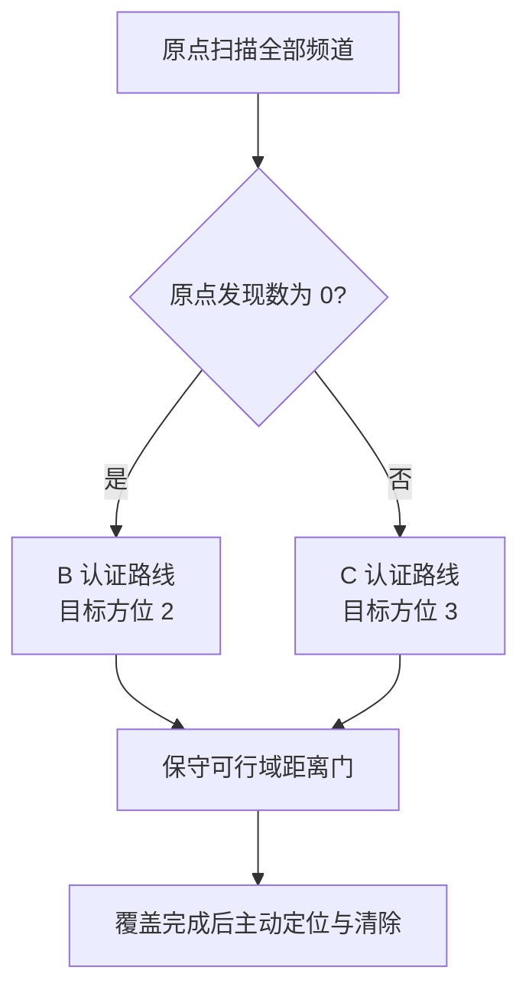

# D 模型说明

## 定位

D 是问题四当前的离线最优模型，冻结自探索阶段的 `C+3FB`。生产类为
`src/q4/d_agent.py` 中的 `DAgent`，并保留 `CPlus3FBAgent` 兼容别名。

D 由三层组成：

1. 在原点扫描全部频道；零发现选择 B 的 27 站认证路线，否则选择 C 的 29 站认证路线；
2. B 分支把每个已发现频道的搜索期有效方位目标设为 2，C 分支设为 3；
3. 两个分支都使用 1500 m 保守距离门，跳过已被证明不可能成功的搜索期共观测。



## 距离门为何安全

每次成功示向把真实源限制在“方位角带 ±1°”与“以观测站为圆心、半径 1500 m 的外包圆”
交集中。实现维护的凸多边形是这个集合的保守外包，因此包含所有与已有成功观测一致的
真实源。对候选站点 \(q\) 和可行域 \(F\)，若

\[
\operatorname{dist}(q,F)>1500\text{ m},
\]

则对任意题设允许的接收半径 \(R\in[1000,1500]\)，该站都不可能接收到该频道。
删除这次测量不会损失任何可能成功的方位。仓库实现同时处理“候选点位于多边形内部”
的情况，此时距离按 0 计算。

生产类不读取模拟器真值。真值只允许存在于独立审计脚本中。

## 主要验收结果

随机源数验证使用每档 50 例和全新种子 20270310—20270342。单位为平均虚拟秒/源：

| 源数 | normal | boundary random | boundary outward | normal 平均总时长 |
|---:|---:|---:|---:|---:|
| 10 | 765.6 | 892.5 | 892.2 | 7656 s |
| 12 | 633.8 | 752.7 | 746.1 | 7606 s |
| 14 | 540.0 | 640.2 | 652.0 | 7559 s |
| 16 | 426.7 | 547.5 | 559.6 | 6828 s |

12 个场景格全部 100% 清除。相对 C+3F 的配对变化为：

| 源数 | normal | boundary random | boundary outward |
|---:|---:|---:|---:|
| 10 | 0.00，逐例相同 | −17.36 [−22.17, −12.55] | −11.59 [−14.98, −8.21] |
| 12 | 0.00，逐例相同 | −18.44 [−21.86, −15.02] | −14.91 [−18.75, −11.06] |
| 14 | 0.00，逐例相同 | −15.31 [−19.28, −11.33] | −15.30 [−20.49, −10.12] |
| 16 | 0.00，逐例相同 | −23.20 [−27.72, −18.67] | −17.24 [−21.31, −13.17] |

在另一批 150 例边界验证中，D 将 boundary random 从 572.30 降到 551.64 秒/源，
将 boundary outward 从 571.18 降到 554.48 秒/源；P95 与 CVaR90 同向下降。

这里的“弱支配”严格指已测试的 normal、boundary random、boundary outward 以及
10/12/14/16 四档源数；它不是对所有连续分布的数学支配证明。

## 当前弱点

- 源数少时仍需完成整条认证路线，因为代理只知道上限 16，不知道真实源数。10—15 源的
  normal 总时间约 7.3—7.7 ks，分摊到每个源后的指标明显高于 16 源。
- 原点门控只能识别“完全看不到”的困难局面；一部分近源可见、一部分远源朝外的 mixed
  场景仍可能选择 C。延迟门控已经实测失败，不宜继续靠加探针修补。
- 距离门只作用于搜索期共观测。搜索后的主动定位仍可能选择最终无信号的测点。
- 全部结论来自离线模拟器，正式接口行为仍需验证。
- B/C 各有 14 个认证站位于半径 1800 m 外。如果官方限制机器狗位置，必须重新设计并
  认证站点；投影或跳过越界站都不能保留现有覆盖保证。

## 接入

```python
from d_agent import DAgent

agent = DAgent(simulator)
result = agent.run()
```

设计资产位于 `src/q4/assets/d_model/`，验证结果位于 `outputs/q4/results/d_model/`。
