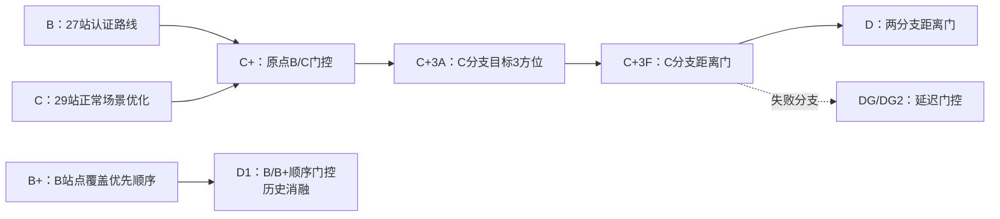

# 问题四模型架构与演进（B—D）

## 1. 文档口径

本文把问题四从认证路线 B、C 到当前 D 的演进整理成可检验的因果链。每次升级都回答四个
问题：上一版弱在哪里；弱指标由什么动作造成；下一版改了什么；新证据是否支持冻结。

不同阶段使用的种子和样本量不完全相同，因此跨表绝对值只用于说明量级。模型升级以同批
案例的配对差为主要证据。所有生产代理不读取信号源真值；真值只用于离线安全审计。

## 2. 当前总体架构

D 把问题分为覆盖、观测分配和定位清除三层：

| 层 | 决策 | 当前实现 |
|---|---|---|
| 覆盖 | 选择保证发现所有源的认证站点路线 | 原点零发现走 B，否则走 C |
| 观测分配 | 在路过站点时是否顺便测已发现频道 | B 目标 2 方位，C 目标 3 方位；1500 m 距离门 |
| 定位清除 | 覆盖结束后定位并清除未完成频道 | 继承 Q4 主动定位与保底走廊清除 |

## 3. B：边界稳健的 27 站认证路线

B 使用 27 个认证站点和边界友好的固定访问顺序。它的覆盖证书不依赖源分布，边界随机与
边界朝外场景均约 568 秒/源，是后续模型的安全分支。

| 场景 | B 均值，秒/源 | 主要弱点 |
|---|---:|---|
| normal | 672.62 | 搜索移动 314.35，路线较长 |
| min radius | 658.16 | 仍需付完整认证巡游成本 |
| mixed | 687.00 | 正常源部分没有吃到 C 的效率 |

B 的主要问题不是清除失败，而是为最坏边界覆盖支付了较高的正常场景移动成本。由此产生
B+ 和 C 两条迭代路线：前者只改顺序，后者重新优化站点集。

## 4. B+ 与 D1：只改顺序的有限收益

B+ 保留 B 的站点集，将覆盖贡献大的站提前。正常场景从约 670.36 降到 655.84 秒/源，
但边界压力从 562.36 上升到 596.49。D1 用原点零发现选择 B 顺序，否则选择 B+ 顺序，
得到正常 655.97、压力 562.36。

这条路线的弱点是候选仍只有同一个 27 站集合，能调整的只是发现日程，无法同时降低整条
巡游成本和搜索后定位成本。D1 被保留为历史消融，不再占用 D 的正式命名。

## 5. C：正常场景快，但边界朝外失守

C 用模拟器内优化得到 29 站路线，路线从内圈走向外圈，终点靠近外层。它在 normal 和
min-radius 场景显著优于 B：

| 场景 | B | C | C 相对 B |
|---|---:|---:|---:|
| normal | 672.62 | 616.29 | −56.33 |
| min radius | 658.16 | 613.30 | −44.86 |
| boundary random | 567.87 | 577.11 | +9.24 |
| boundary outward | 567.62 | 765.62 | **+198.00** |

边界朝外是 C 的核心弱指标。动作分解显示，C 的搜索后测量点数约为 B 的 1.76 倍，搜索后
移动约为 1.50 倍；约 86% 的总差距来自搜索后定位。C 的内圈前缀虽然便于正常局早发现，
却容易在朝外定向源上积累质量差的单方位，最终需要反复移动和试探。

因此下一版没有继续整体替换 B，而是让 B 和 C 分别负责自己擅长的场景。

## 6. C+：原点零发现的 B/C 门控

C+ 在原点扫描后使用最简单的可观测规则：零发现走 B，至少发现一个走 C。

| 场景 | C+ | 选择效果 |
|---|---:|---|
| normal | 616.29 | 基本等于 C |
| min radius | 612.99 | 少量案例切 B |
| boundary random | 567.87 | 等于 B |
| boundary outward | 567.62 | 等于 B，修复 C 的 765.62 |
| mixed | 716.00 | 弱于 B 的 687.00 |

C+ 解决了“全部困难源导致原点零发现”的场景，但 mixed 中只要存在少量近源，门控就会走
C，因此无法保护远处朝外源。原点发现数、可见比例、示向角隙等简单特征 AUC 仅约
0.43—0.57；调阈值只能在不同场景间搬运风险。

门控已经接近其简单信息上限，下一轮转向 C 分支的搜索后定位质量。

## 7. C+3A：用第三条方位换定位移动

C+3A 保持门控和站点不变，只把 C 分支的搜索期目标方位数从 2 提到 3。

| 场景 | C+ | C+3A | 配对变化 |
|---|---:|---:|---:|
| normal | 616.29 | 602.77 | −13.51 |
| min radius | **612.99** | 620.87 | +7.88 |
| boundary random | 567.87 | 567.87 | 0.00 |
| boundary outward | 567.62 | 567.62 | 0.00 |
| mixed | 716.00 | 709.72 | −6.28 |

normal 中第三方位让搜索后移动约减少 43.30 秒/源，但增加约 21.84 秒检测和 4.78 秒切换，
净收益约 13.51 秒/源。min-radius 反向说明固定目标 3 过于粗糙：大量候选站离源太远或位于
定向波束背面，第三次测量只有成本，没有新方位。

下一版保留第三方位带来的几何收益，同时剪掉确定不可能成功的测量。

## 8. C+3F：C 分支的保守距离门

C+3F 对候选共观测站与当前保守可行域计算最小距离。距离超过接收半径上界 1500 m 时，
跳过该测量。它实际过滤 C 分支的第二、第三条搜索期共观测，并非只过滤第三条。

| 场景 | C+ | C+3A | C+3F |
|---|---:|---:|---:|
| normal | 616.29 | 602.77 | **573.13** |
| min radius | 612.99 | 620.87 | **575.67** |
| boundary random | 567.87 | 567.87 | 567.87 |
| boundary outward | 567.62 | 567.62 | 567.62 |
| mixed | 716.00 | 709.72 | **661.53** |

C+3F 保留了 C+3A 的搜索后移动水平，却把 normal 检测时间从 154.13 降到 129.41 秒/源。
其弱点也因此非常明确：原点零发现时仍完整退回 B，B 分支的盲区共观测没有被过滤。

## 9. DG 与 DG2：延迟门控为何失败

DG 先走 C 的若干前缀站，用累计新增发现数再决定继续 C 或切 B。信息确实增加：在两类
边界极端场景中，走 3—5 站后的分类 AUC 可达 0.918—0.987。但信息不是免费的：C 前缀、
频道扫描和接入 B 路线的移动，与门控信息价值处于同一量级。

DG2 进一步用最近邻与 2-opt 从当前位置重排完整 B 站点集，结果仍更差。该算法缩短局部
衔接，却破坏 B 原顺序的早期覆盖日程。连续过渡实验只在朝外占比
0、0.25、0.5、0.75、1.0 五档成立；五档中 DG/DG2 都不是最优，均被“始终走 C”和
C+3F 的逐档包络压住。因此延迟门控不命名，只关闭纯路程重排方向。

## 10. D：两分支统一距离门

D 冻结自 C+3FB。它保持 C+3F 的所有行为，只把同一个保守距离门扩展到 B 分支搜索期
共观测。B 的站点集、顺序、目标方位 2 和覆盖证书均不改变。

150 例边界验证：

| 场景 | C+3F | D | 配对差，95% CI | P95 变化 | CVaR90 变化 |
|---|---:|---:|---|---:|---:|
| boundary random | 572.30 | **551.64** | −20.66 [−22.84, −18.48] | 657.55→624.92 | 675.90→640.01 |
| boundary outward | 571.18 | **554.48** | −16.70 [−19.37, −14.04] | 689.39→649.24 | 704.62→661.92 |

10/12/14/16 源的分层验证中，normal 与 C+3F 逐例相同；两个边界场景每一档配对置信区间
上界均小于 0，12 个格全部 100% 清除。因此 D 在题设源数区间的已测离散档位上弱支配
C+3F，正式获得 D 名称。

## 11. 各模型的主要提升点与弱指标

| 模型 | 相对上一版的提升 | 最弱指标 | 原因 | 下一版如何迭代 |
|---|---|---|---|---|
| B | 建立边界稳健的认证覆盖 | normal 672.62 | 27 站安全路线移动成本高 | 优化顺序或站点集 |
| B+ | normal 发现日程更快 | 边界压力约 +34 | 覆盖优先顺序损害边界日程 | D1 用原点门控顺序 |
| D1 | 保住 B 边界并接近 B+ normal | normal 仍约 656 | 仍受同一 27 站集合限制 | 引入 C 路线 |
| C | normal 比 B 快约 56 | outward 765.62 | 搜索后方位质量差，重复定位 | C+ 用 B 作保险分支 |
| C+ | 修复全边界朝外 | mixed 716.00 | 原点少量可见即走 C | 不再调简单阈值，改定位质量 |
| C+3A | normal 搜索后移动下降 | min-radius +7.88 | 固定第三方位产生大量盲测 | 用可行域过滤不可能测量 |
| C+3F | normal/min-radius/mixed 全面下降 | B 分支边界约 568 | 距离门只作用于 C 分支 | 把安全过滤扩展到 B |
| D | 边界再降约 12—23 | 10 源秒/源高；正式接口未知 | 未知真实源数需走完整证书；仍有主动定位盲测 | 先验接口，再评估主动定位过滤 |

## 12. 源数效应

D 不知道真实源数，只知道最多 16。发现 16 个频道后可以安全提前停止；发现 10—15 个时
不能证明没有遗漏，必须继续完整认证路线。因此 normal 总时间在 10—15 源时约为
7.3—7.7 ks，16 源因提前停止降到约 6.8 ks。按源数归一化后，10 源约 765.6 秒/源，
16 源约 426.7 秒/源。

这不是清除失败，而是认证搜索的固定成本。模型筛选应同时报告每局总虚拟时间和秒/源；
若官方排名按总时间，应以总时间为主指标。

## 13. 当前结论与下一轮

D 是当前离线证据最强的版本。下一轮按以下顺序进行：

1. 用官方接口确认请求位置能否超过 1800 m。若禁止越界，B/C 站点必须重新设计并认证；
2. 把保守可达性用于搜索后的主动定位候选筛选。该改动会改变后续决策，需作为独立模型
   做配对消融，不能预先宣称弱支配；
3. 若官方能提供真实源数，则利用它安全提前停止；若不能，不能用统计猜测替代覆盖证书；
4. 时间型顺序优化只在同时建模发现日程、移动、检测和终点价值时再重启。

当前实现、资产和验证数据均已收入仓库，详见 `src/q4/` 与 `outputs/q4/results/d_model/`。
